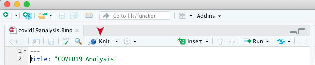

# Objectives

The learning objectives for this practical are:

  * Create R Markdown documents.
  * Create R Markdown websites.

# Setup and background

To do this practical you need an installation of R and RStudio. You can find
the instructions in the [setup](/setup/) link on how to install R and RStudio
in your system.

# R Markdown documents

Go to RStudio and create a new R Markdown file by doing
`File -> New File -> R Markdown ...` with the default option for output format
(HTML). Give the text `COVID19 Analysis` as title. You will get a sample R
Markdown file, press the `knit` button on top of the source code panel (see
image below with a red arrow pointing to that button).



After processing the file, a popup window should appear displaying the HTML
page of the R Markdown file. Now modify this file to contain some part of
the analysis of the COVID19 data from [practical 8](/practical8/). The final
R Markdown document should contain:

1. Some text explaining what the R code does.
2. At least one figure.
3. At least one table with the numerical results.

Alternatively, if your prefer, you may practice with R Markdown by starting
with the analysis of the data of your FCB project, but put just some R code
to allow you having time to do the rest of this practical.

Slides 7 to 11 from the
[lecture](https://funcompbio.github.io/lecture9/#7) about reproducibility
contain a succint summary of R Markdown, but the internet is plenty of
materials to learn it. In particular, the website
[https://rmarkdown.rstudio.com](https://rmarkdown.rstudio.com) contains
well structured learning material and example, concretely, in this
[link](https://rmarkdown.rstudio.com/lesson-1.html) you can find a
more comprehensive description of the R Markdown language, in the section
[Tables](https://rmarkdown.rstudio.com/lesson-7.html) you can find a way to
pretty print the table with numerical results and in this other
[link](https://rmarkdown.rstudio.com/authoring_basics.html) you have a quick
reference to the most commonly used R Markdown syntax. The `Help` menu of
RStudio also has links to many resources including cheatsheets for R Markdown.

The action performed by the `knit` button in RStudio can be instructed from
the R shell by typing the following:

```
> rmarkdown::render("filename.Rmd")
```
where **you should replace** `filename.Rmd` by the filename of the R Markdown
document your are working on. The previous instruction assumes you have
[set the working directory](https://funcompbio.github.io/seminar4/#13)
of RStudio to the directory where the R Markdown file is located.

Likewise, you can process the R Markdown document from the Unix shell command
line with the following instruction:

```
$ Rscript -e "rmarkdown::render('filename.Rmd')"
```

# R Markdown websites

The [rmarkdown package](https://rmarkdown.rstudio.com/docs) provides the
possibility of building what the authors of that package call
_Markdown websites_, which is web page displaying the contents of two or
more R Markdown documents. To see how it works you need to follow the
next steps:

1. Have a main R Markdown document stored under the filename `index.Rmd`.
2. Make a directory called `docs` within the directory where the R
   Markdown file `index.Rmd` is.
3. In the same directory where the R Markdown file `index.Rmd` is, create
   a Markdown file called `about.md` with the following contents:
   ```
   ---
   title: About this website
   ---

   This website was created by me
   ```
4. In the same directory where the R Markdown file `index.Rmd` is, create
   a YAML text file called `_site.yml` with the following contents:
   ```
   name: "my-first-rmarkdown-website"
   output_dir: "docs"
   navbar:
     title: "My first R Markdown Website"
     left:
       - text: "Home"
         href: index.html
       - text: "About"
         href: about.html
   output:
     html_document:
   ```
5. Having the [working directory](https://funcompbio.github.io/seminar4/#13)
   of RStudio pointing to the directory were you stored the previous files,
   type the following instruction in the R shell:
   ```
   > rmarkdown::render_site()
   ```
   **alternatively**, you can also create the website from the Unix shell command
   line by going into that directory and typing:
   ```
   $ Rscript -e "rmarkdown::render_site()"
   ```
6. Open the file `docs/index.html` in your web browser and you should see your
   first _R Markdown website_.

You may consult the help page of the function `render_site()` from the
[rmarkdown package](https://rmarkdown.rstudio.com/docs) for further details on
available parameters and how it works. Essentially, it looks up for the files
`_site.yml` and `index.Rmd`, and every other `.Rmd`, `.md` or `.html` file, and
process them to put them together as a website in the directory `docs` (the
name of this directory can be changed through the keyword `output_dir` in the
`_site.yml` file, omitting this keyword will result in creating the website in
a directory called `_site`).

**Exercise**: using the GitHub repo you created in
[practical 9](/practical9#publish-your-website-with-gitHub-pages)
by accepting the GitHub Classroom assignment called _Website assignment_,
move your R Markdown documents and website to that repo and try to see it
displayed through the GitHub Pages private URL from that GitHub repo. If
you want to keep the contents you had in the `index.Rmd` from that repo,
rename that file to some other name.
